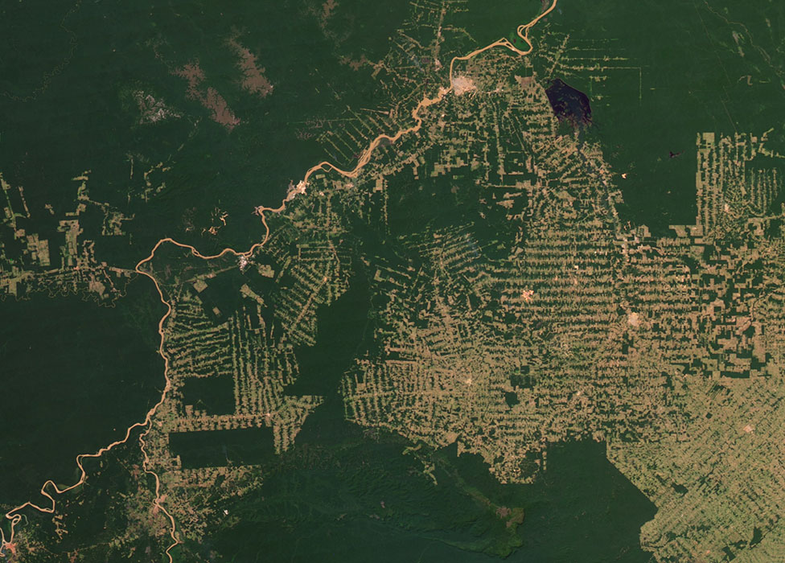
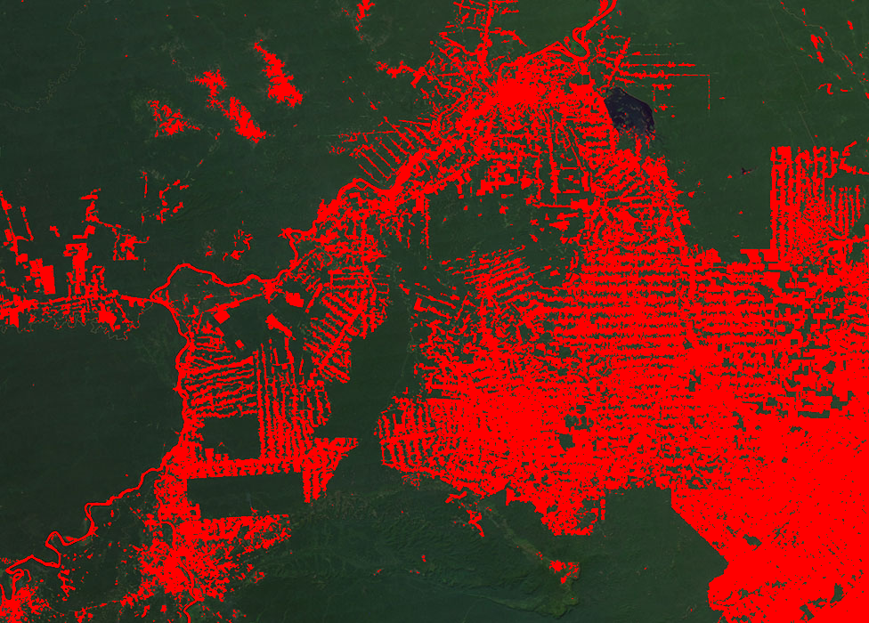

# Deforestation Detection with KNN

This repository contains a Python script that performs the classification of satellite images in order to detect deforestation areas. The application leverages the k-Nearest Neighbors algorithm to detect deforestation patches and highlight them in red for easy visualization. This repository also includes two curated datasets for the classification algorithm, one for forest and another for deforestation areas.

## Prerequisites

Before running the script, ensure you have the following:

- **Python 3.x:** Make sure Python 3 and pip are installed on your system. You can download Python from [the official website](https://www.python.org/downloads/).
- **NumPy:** This application requires the NumPy library to handle image data.

You can install numpy using pip:

`pip install numpy`

## Installation

1. **Clone the Repository:**

   ```
   git clone https://github.com/joaotav/satellite-deforestation-detection.git
   ```

## Usage

To classify an image, execute the script using the following command:
```
python3 detect_deforestation.py <image.ppm> <k_value> <block_size>
```
**Where:**
   - **<image.ppm>**: Path to the PPM image file you want to classify.
   - **<k_value>**: Value for k in the kNN algorithm, which determines the number of nearest neighbors considered for classification.
   - **<block_size>**: Size of the blocks the image is divided into for patch analysis, smaller numbers increase the precision of classification but require longer execution times.

**Example:**

```
python3 detect_deforestation.py sattellite_img.ppm 16 2
```

This will separate the image into blocks of 2x2 pixels and classify them using a `k_value` of 16.
The classified output will be saved as `output.ppm`.

## Example Classification:

### Input image (Classified using `k_value` = 16 and `block_size` = 1):



### Output image:


